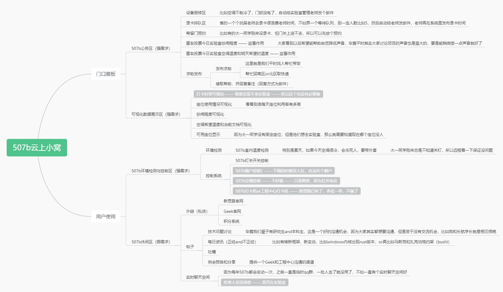

# 507b云小窝

这个是基于物联网技术，为我们`Geek`实验室`507b`所做的实验室管理系统，不仅包括实验室日常管理，同时也包括对实验室环境的采集，灯光的控制，窗户的控制等等

成员：阿悦、小李（本人）、老陈、小🐏，开开

- 前端：`vue`

- 服务端：`springboot`整合`SSM`
- `MQTT`消息服务器（`broker`）：`EMQX`
- 数据库：`MySQL`
- 有线通信：`RS485`

